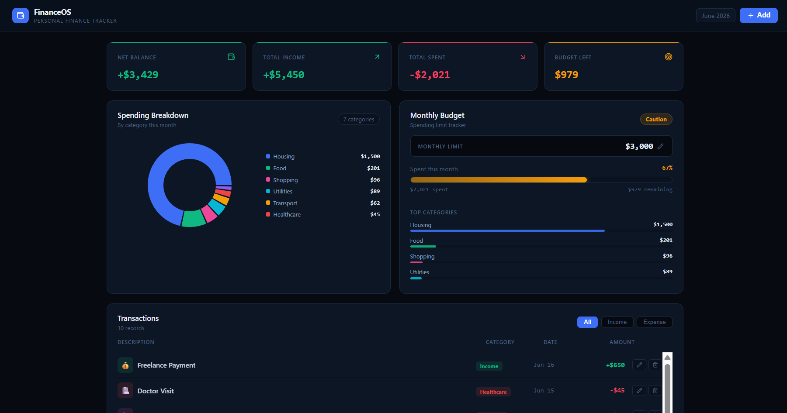

# FinanceOS

A responsive personal finance dashboard built with React and Vite. It provides real-time tracking for income, expenses, and savings goals.



## 🚀 Features

* **Financial Summaries:** Real-time metrics for total balance, monthly income, and monthly expenses.
* **Transaction Logging:** Dynamic forms to add, categorize, and delete transactions.
* **Savings Progress:** Visual progress bars tied to specific financial goals.
* **Responsive Layout:** Built with a mobile-first design approach.

## 🛠️ Tech Stack

* **Frontend:** React 18
* **Build Tool:** Vite
* **Styling:** Tailwind CSS
* **State Management:** React Hooks (`useState`, `useEffect`)

## 📦 Project Structure

```text
FinanceOS/
├── index.html
├── package.json
├── vite.config.js
└── src/
    ├── main.jsx          # Application entry point
    └── App.jsx           # Core layout and state management

💻 Getting Started
Prerequisites
Ensure you have Node.js installed (v18 or higher recommended).

Installation
Clone the repository:

git clone [https://github.com/Haris-4545/FinanceOS.git](https://github.com/Haris-4545/FinanceOS.git)

Navigate into the project directory:

cd FinanceOS

Install dependencies:
npm install

Running the Local Server
To launch the development server:
npm run dev

Open your browser and navigate to http://localhost:5173 to view the application.

📄 License
This project is open-source and available under the MIT License.
